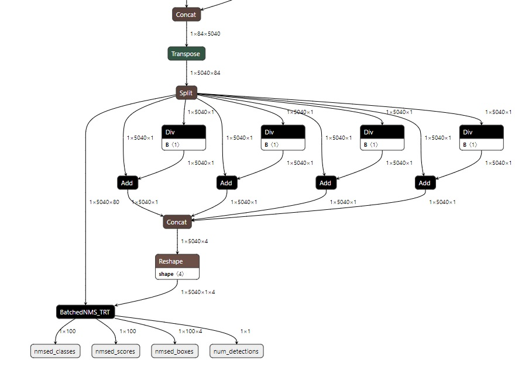

# YOLOv8 TensorRT 快速部署工具

## What is this

- 通过yolov8官方代码训练生成的权重文件，均可通过此项目转换为tensorrt量化模型，同时支持常规模型以及端到端模型
- 进一步的，同样支持输出维度结构为
```python
#                  批大小        预测框数量    x, y, w, h, obj_conf, label_scores
outputs.shape = [batch_size, number_of_preds, 5 + number_of_classes]
outputs.shape = [batch_size, 5 + number_of_classes, number_of_preds]

# 或者                                         x, y, w, h, scores
outputs.shape = [batch_size, number_of_preds, 4 + number_of_classes]
outputs.shape = [batch_size, 4 + number_of_classes, number_of_preds]
```
的其他目标检测模型的onnx文件转换为tensorrt的engine文件和便于python使用的pt文件.


## 环境准备

- CUDA, CuDNN, TensorRT（Toolkit）
- 所有requirements.txt中的三方库

**注意** 

- end2end模型要求TensorRT版本为8.0.0及以上（本人使用的是TensorRT-8.0.1.6.Windows10.x86_64.cuda-11.3.cudnn8.2）
- 由于修改了原项目ultralytics中的一些函数，所以导出模型时不要将原项目代替本项目中的ultralytics文件夹

其中 **torch2trt** 安装如下
```shell
git clone https://github.com/NVIDIA-AI-IOT/torch2trt.git
cd torch2trt
python setup.py install
```
python 的 **tensorrt** 通过 TensorRT Toolkit中提供的安装包安装，然后

```shell
git clone https://github.com/LSH9832/yolov8_trt
cd yolov8_trt
pip install -r requirements.txt
```

## 使用

- 支持转onnx、tensorrt engine文件以及将engine文件与相关信息打包的，便于python中使用的pt文件
- 支持常规模型以及端到端（End2End）模型

### 下载模型
通过yolov8官方方式下载模型
```shell
python download_all_models.py
```

### 导出模型
```shell
# mode有以下5个

# 1. onnx：仅导出onnx常规模型

# 2. trt：导出onnx及tensorrt常规模型
# 3. end2end：导出onnx常规模型，并通过其导出end2end模型，再转化为end2end的engine模型

# 4. onnx2trt: 其他非yolov8模型的onnx文件（未添加end2end结构）转换为tensorrt常规模型
# 5. onnx2end2end: 其他非yolov8模型的onnx文件（未添加end2end结构）转换为端到端onnx模型，再转化为end2end的engine模型
python export.py --mode trt

                 # 如果是yolov8模型（trt模式或end2end模式），输入以下4个参数
                 --weights yolov8s.pt
                 --batch 1
                 --img-size 640 640    # 4:3视频流设为 480 640， 16:9视频流设为 384 640
                 --opset 11
                 
                 # 否则（onnx2trt模式或onnx2end2end模式）输入以下2个参数
                 --onnx yolov7.onnx   # 其他模型的onnx文件
                 --cfg yolov7.yaml    # 所需包含的信息见下文
                 
                 # 以下所有参数如为onnx模式不用写
                 --workspace 10   # 转换为tensorrt模型时最大使用的显存空间(GB)
                 --fp16           # int8, best，模型精度使能
                 
                 # 以下为end2end模式和onnx2end2end模式所需参数(Batched_NMS中所需参数)，其他模式不用填写
                 --conf-thres 0.2   # 置信度阈值
                 --nms-thres 0.6    # NMS 目标框重合度阈值
                 --topk 2000        # 选置信度最高的前K个目标框作为NMS的输入
                 --keep 100         # NMS之后最多保留前K个置信度最高的结果
```

其中，--cfg 指向的yaml文件应该包含如下信息
```
batch_size: 1                   # int        批大小
pixel_range: 1                  # int        输入图像像素值范围， 1代表[0, 1]之间（YOLOv5,6,7等），255代表[0, 255]之间（YOLOX等）
obj_conf_enabled: true          # bool       是否使用了前景预测（obj_conf）, 注意true和false开头字母用小写
img_size: [640, 640]            # List[int]  输入图像 [高，宽]，注意不要反了
input_name: ["input_0"]         # List[str]  onnx文件输入变量名
output_name: ["output_0"]       # List[str]  onnx文件输出变量名
names: ["person", "car", ...]   # List[str]  类别名称
```

不同模式导出不同模型，下面以yolov8s.pt为例

- onnx模式
```shell
./yolo_export/yolov8s/yolov8s.onnx   # 常规模型
./yolo_export/yolov8s/yolov8s.yaml   # 模型相关信息
./yolo_export/yolov8s/yolov8s.json   # 模型相关信息
```
- trt模式
```shell
./yolo_export/yolov8s/yolov8s.onnx   # 常规模型
./yolo_export/yolov8s/yolov8s.yaml   # 常规模型相关信息
./yolo_export/yolov8s/yolov8s.json   # 常规模型相关信息

./yolo_export/yolov8s/yolov8s.engine # 用于C++部署
./yolo_export/yolov8s/yolov8s.pt     # 用于python部署
```

- end2end模式
```shell
./yolo_export/yolov8s/yolov8s.onnx   # 常规模型
./yolo_export/yolov8s/yolov8s.yaml   # 常规模型相关信息
./yolo_export/yolov8s/yolov8s.json   # 常规模型相关信息

./yolo_export/yolov8s/yolov8s_end2end.onnx   # 端到端模型
./yolo_export/yolov8s/yolov8s_end2end.json   # 端到端模型相关信息
./yolo_export/yolov8s/yolov8s_end2end.engine # 用于C++部署
./yolo_export/yolov8s/yolov8s_end2end.pt     # 用于python部署
```

端到端的模型最后会增加如下结构, 相关代码改自[https://github.com/DataXujing/YOLOv8](https://github.com/DataXujing/YOLOv8)


### 推理

#### python
由本项目生成的，不论是常规模型还是端到端模型，均可使用，不依赖原项目的函数功能
```shell
python trt_infer.py --weight ./yolo_export/yolov8s/yolov8s.pt
                    --source path/to/your/video/file or (rtsp/rtmp/http)://xxx.xxx.xxx.xxx/live/xxx or 0
                    --no-label   # 声明此项则不会显示类别与置信度标签，仅显示目标框
                    
                    # 以下为常规模型所需参数，端到端模型无效
                    --conf 0.2     # 置信度阈值
                    --nms 0.6      # NMS 目标框重合度阈值
```

#### c++
即将推出，着急用可到其他项目中找找
